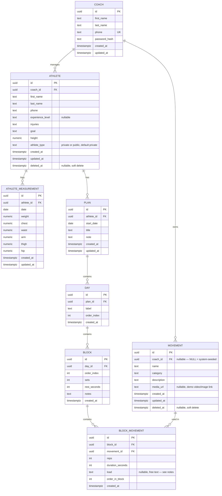

# GoGym — ER Diagram v1

Derived from the entity list in [spec.md](spec.md). Two chains hanging off `Coach`:

- `Coach → Athlete → AthleteMeasurement`
- `Athlete → Plan → Day → Block → BlockMovement → Movement`

`Movement` is a coach-owned library, not per-athlete, so `BlockMovement` is the join between a `Block` and the shared `Movement` catalog.

## Notes / decisions made while modeling

- **coach_id placement:** per the multi-coach-readiness note in the spec, `coach_id` lives on `Athlete` and `Movement` directly (matching the original entity definitions). `Plan`, `Day`, `Block`, and `BlockMovement` reach the coach transitively through `Athlete`/`Plan`, so they are not denormalized with a redundant `coach_id` column — revisit if query patterns need it.
- **Movement is coach-scoped, not athlete-scoped:** `BlockMovement` is the many-to-many join between `Block` and the shared `Movement` library, carrying the per-use fields (`reps`, `duration_seconds`, `order_in_block`).
- **`Movement.coach_id` is nullable:** `NULL` marks a universal, system-seeded movement (visible to every coach, read-only — coaches cannot edit or delete these); a non-null value is a coach's own custom movement, which they fully own. A coach's effective library is `coach_id = :coach_id OR coach_id IS NULL`.
- **Timestamps:** every table gets `created_at`. `updated_at` is added only to tables edited in place after creation (`Coach`, `Athlete`, `AthleteMeasurement`, `Plan`, `Movement`); `Day`, `Block`, and `BlockMovement` are typically deleted and recreated by the plan builder rather than edited, so they carry `created_at` only.
- **`Athlete.experience_level` is nullable:** a coach may add an athlete before assessing their experience level.
- **`Athlete.athlete_type` (`private` | `public`, added in migration `000002`) is the coach's service tier for that athlete, not a training format:** `private` athletes pay more and are managed by the coach on an ongoing basis — their plans belong on the coach's home screen. `public` athletes pay less and get a single plan delivered as a share link (see [product-direction.md](product-direction.md)'s plan-share-link idea); once sent, the coach does no further work with them. `NOT NULL DEFAULT 'private'`, enforced by a `CHECK` constraint since dashboard/home-screen filtering depends on this value always being one of the two.
- **`BlockMovement.load` (added in migration `000003`) is free text, not a numeric kg column — an explicit judgment call:** coaches prescribe load as "%1RM", RPE, "bodyweight", or a plain kg figure interchangeably, and a numeric-only column would force lossy conversion at entry time for anything that isn't a plain weight. Nullable, since not every movement (e.g. a timed hold) carries a load. Revisit toward a structured/numeric model once the plan builder or reporting needs to compute or chart load directly.
- **`Movement.media_url` (added in migration `000003`) is a nullable link to a demo video/image.** Adding the column now does not commit v1 to building an upload flow — it only implies that flow, when built, will need object storage (S3, MinIO, or a local provider). No upload flow is built as part of this change.
- **Soft delete (`deleted_at`, added in migration `000003`) on `Athlete` and `Movement`:** these are the coach-owned tables a coach can delete from the UI. Both use GORM's `gorm.DeletedAt` convention (nullable `timestamptz`, indexed) so GORM's default query scope excludes soft-deleted rows automatically, without an explicit `deleted_at IS NULL` in application code. This does not change the movement library's own visibility rule (`coach_id = :coach_id OR coach_id IS NULL`) — the soft-delete scope simply ANDs onto it, so a soft-deleted universal or custom movement drops out of every coach's effective library the same way a soft-deleted row drops out of any other query. `Plan`, `Day`, `Block`, `BlockMovement`, `Coach`, and `AthleteMeasurement` are not soft-deleted: they are either reached transitively through a soft-deleted parent (cascading deletes still apply at the DB level for hard deletes) or not directly deletable from the UI in v1. Preloading a soft-deletable parent from a row that references it (e.g. `block_movement → movement`) needs `Unscoped()`, or the parent comes back zero-valued once it's deleted — a plan must still name a movement the coach has since removed from the library.
