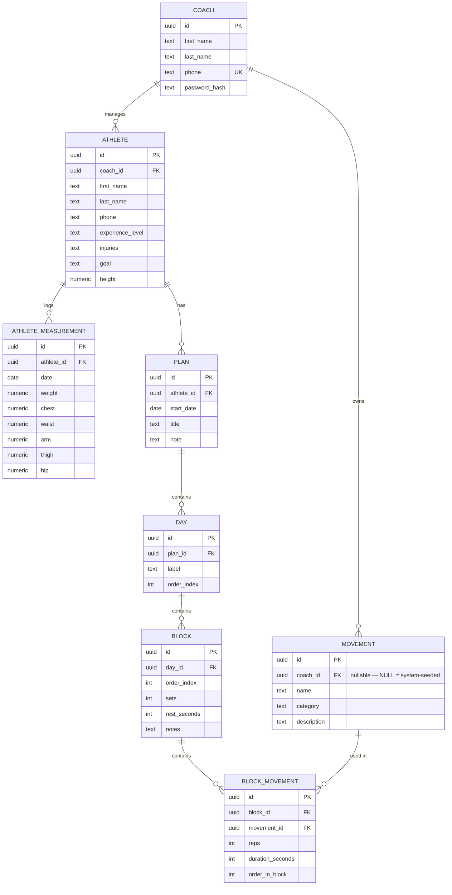

# GoGym — ER Diagram v1

Derived from the entity list in [mvp-spec.md](mvp-spec.md). Two chains hanging off `Coach`:

- `Coach → Athlete → AthleteMeasurement`
- `Athlete → Plan → Day → Block → BlockMovement → Movement`

`Movement` is a coach-owned library, not per-athlete, so `BlockMovement` is the join between a `Block` and the shared `Movement` catalog.

## Notes / decisions made while modeling

- **coach_id placement:** per the multi-coach-readiness note in the spec, `coach_id` lives on `Athlete` and `Movement` directly (matching the original entity definitions). `Plan`, `Day`, `Block`, and `BlockMovement` reach the coach transitively through `Athlete`/`Plan`, so they are not denormalized with a redundant `coach_id` column — revisit if query patterns need it.
- **Movement is coach-scoped, not athlete-scoped:** `BlockMovement` is the many-to-many join between `Block` and the shared `Movement` library, carrying the per-use fields (`reps`, `duration_seconds`, `order_in_block`).
- **`Movement.coach_id` is nullable:** `NULL` marks a universal, system-seeded movement (visible to every coach, read-only — coaches cannot edit or delete these); a non-null value is a coach's own custom movement, which they fully own. A coach's effective library is `coach_id = :coach_id OR coach_id IS NULL`.
